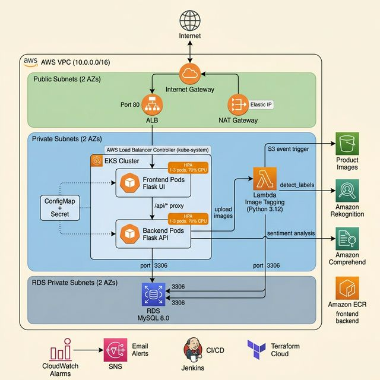
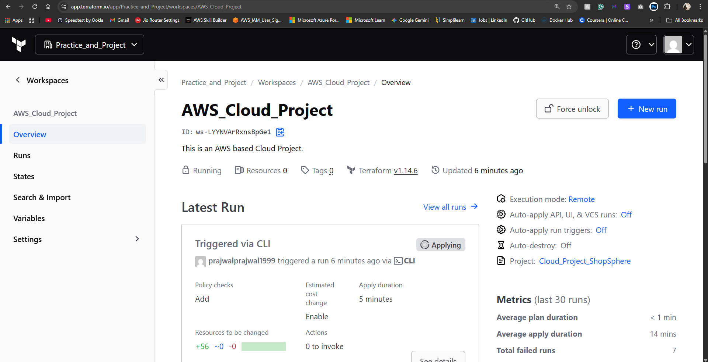
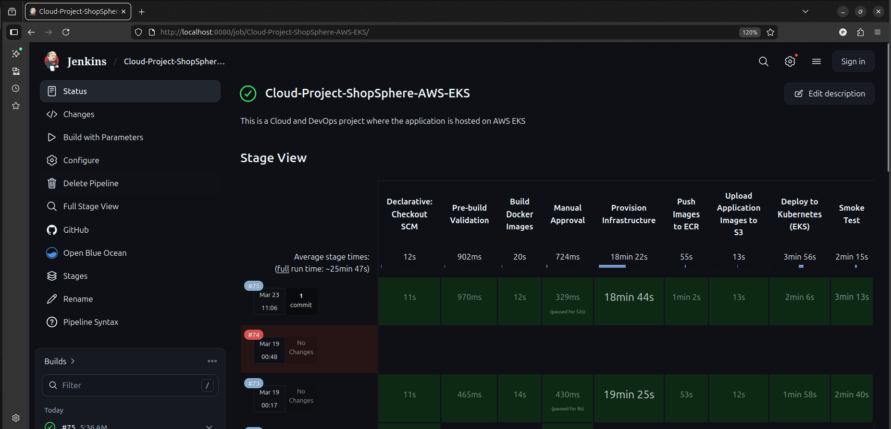
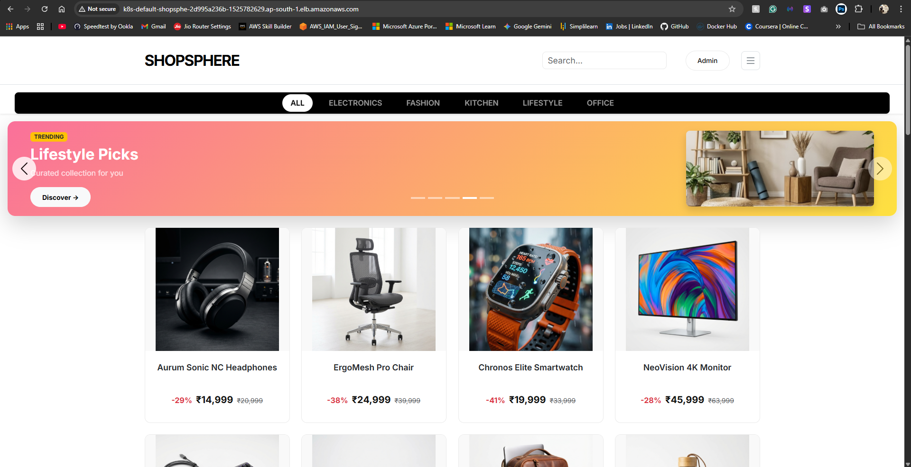
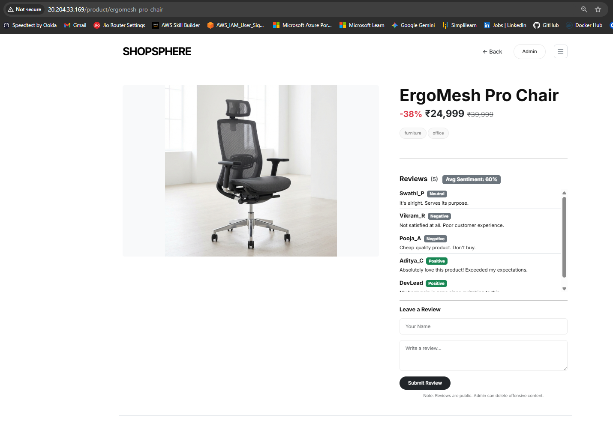
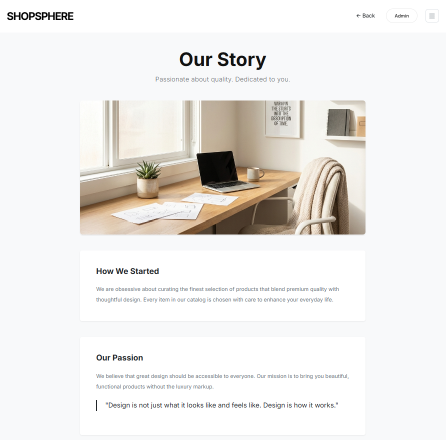
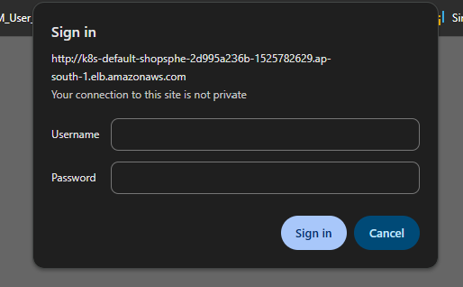
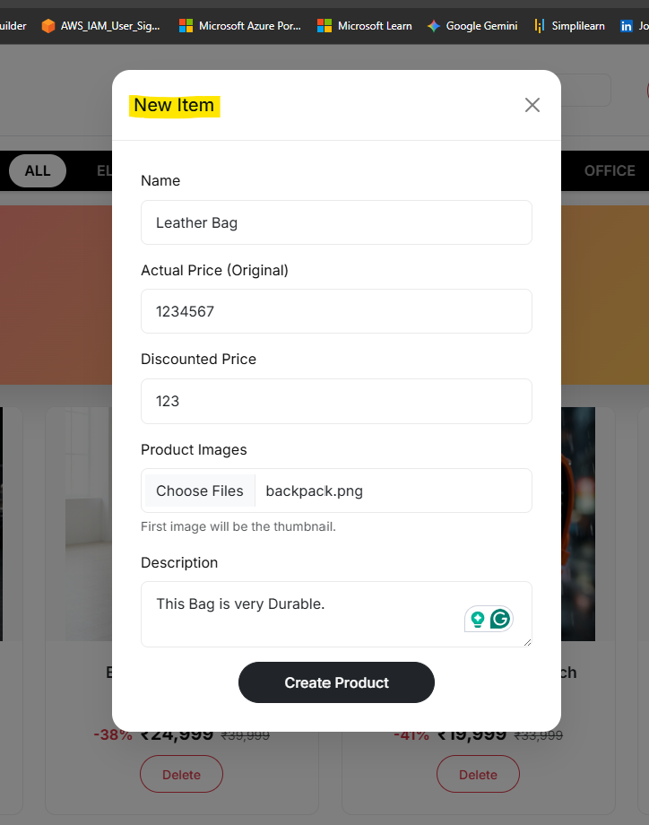
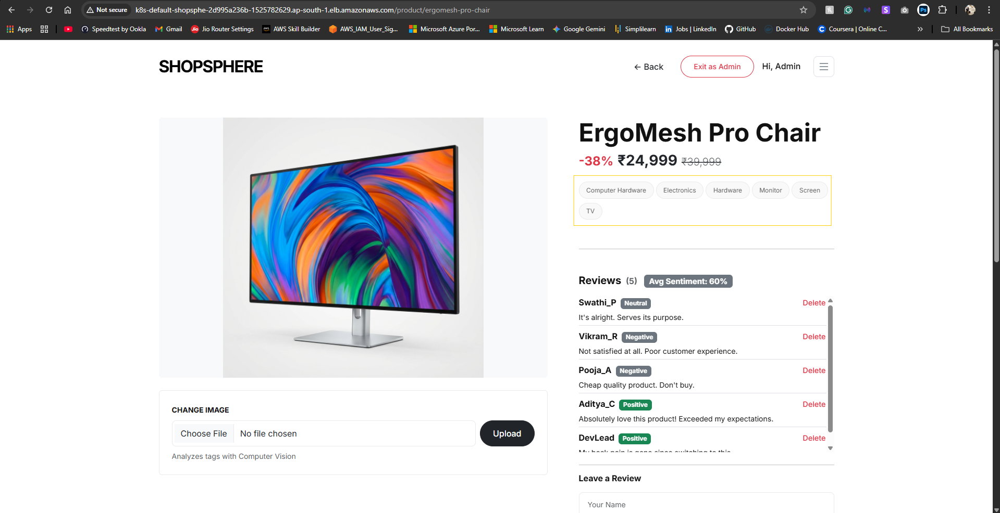
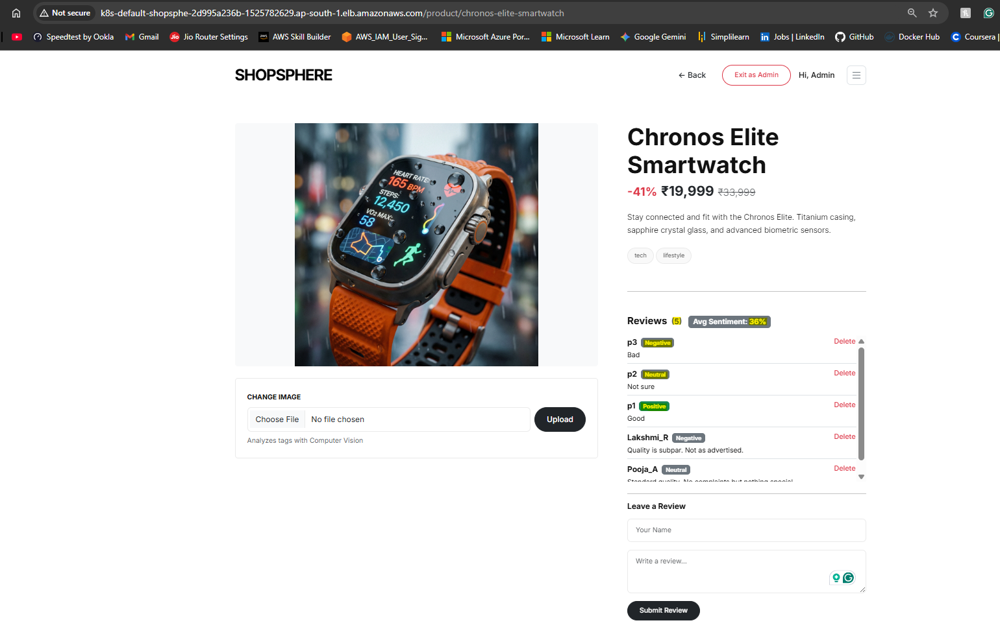

# ShopSphere - AWS EKS Cloud Project

A fully automated, end-to-end cloud deployment of a product catalog web application on AWS. The application runs as containerized microservices on EKS (Elastic Kubernetes Service), with the entire infrastructure provisioned through Terraform. Includes a Jenkins CI/CD pipeline, Helm-based Kubernetes deployments, AI-powered image tagging using Rekognition and sentiment analysis using Comprehend, Horizontal Pod Autoscaling, and CloudWatch monitoring with SNS alerts.

📂 **[Project Demo & Resources (Google Drive)](https://drive.google.com/drive/folders/1jdCNKH5LpH2cl4W3ouOL3Q5EWulntH_M?usp=sharing)** — Contains the project related files.

## What This Project Demonstrates

- **Container Orchestration** on AWS EKS with managed node groups and SPOT instances
- **Infrastructure as Code** using Terraform with 6 modular components
- **Remote State Management** using Terraform Cloud
- **CI/CD Pipeline** using Jenkins with 2 deployment modes (Deploy, Destroy)
- **Containerization** — Docker with separate frontend and backend images pushed to ECR
- **Helm Charts** for templated, reusable Kubernetes deployments
- **Networking & Security** — VPC, Public/Private Subnets, NAT Gateway, Security Groups, IAM Roles
- **Ingress & Load Balancing** — AWS Load Balancer Controller with ALB Ingress
- **Autoscaling** — Horizontal Pod Autoscaler (HPA) for frontend and backend pods
- **Serverless** — AWS Lambda with S3 trigger and VPC integration
- **AI Integration** — Rekognition for image tagging + Comprehend for sentiment analysis
- **Monitoring & Alerts** — CloudWatch Metric Alarms with SNS email notifications
- **Credential Management** — Jenkins credentials, K8s Secrets, IAM policies

## The Web Application (ShopSphere)

The core of this project is **ShopSphere**, a fully functional product catalog web application built with **Python Flask**. It has a decoupled frontend-backend architecture designed to run as separate containerized microservices on Kubernetes.

**Pages:**
- **Home Page (`/`)** — Product catalog with a promotional carousel, category filtering (Electronics, Fashion, Kitchen, Lifestyle, Office), live search, and a responsive product grid with pricing in ₹
- **Product Details (`/product/<slug>`)** — Full product view with AI-generated image tags, customer reviews with sentiment analysis badges, review submission form, and a "You might also like" recommendation section
- **About Page (`/about`)** — Store's origin story with hero image, content sections, and an inspirational quote
- **Admin Login (`/admin-auth`)** — Secure admin portal using HTTP Basic Authentication to unlock product management across all pages
- **Health Check (`/health`)** — Lightweight endpoint used by K8s liveness probes, ALB health checks, and the Jenkins smoke test

**Admin Features:**
- Add new products (name, price, description, images) via a modal form on the home page
- Upload or change product images — triggers automatic AI tagging via Lambda
- Delete products and moderate customer reviews

**AI Integration:**
- **Image Tagging** — Uploading a product image to S3 triggers a Lambda function that uses Rekognition to auto-generate descriptive tags, powering search, filtering, and recommendations
- **Sentiment Analysis** — Every review is analyzed by Comprehend, displaying Positive/Neutral/Negative/Mixed labels with confidence scores

**Tech:** Flask, Jinja2, Bootstrap 5, vanilla JavaScript, MySQL (RDS), S3 for images.

For the complete breakdown of every page, API endpoint, database schema, and architecture details, see [**The Web Application — Detailed Description**](#the-web-application--detailed-description) below.

## Architecture Overview



```
                                INTERNET
                                    │
                           ┌────────▼────────┐
                           │    AWS ALB      │
                           │   (Ingress)     │
                           │    Port 80      │
                           └────────┬────────┘
                                    │
  ┌─────────────────────────────────┴─────────────────────────────────┐
  │                              VPC                                  │
  │                                                                   │
  │  ┌─────────────────────────────────────────────────────────────┐  │
  │  │   Public Subnets (2 AZs)                                    │  │
  │  │   ALB + NAT Gateway                                         │  │
  │  └──────────────────────────────┬──────────────────────────────┘  │
  │                                 │                                 │
  │  ┌──────────────────────────────┼──────────────────────────────┐  │
  │  │   Private Subnets (2 AZs)    │                              │  │
  │  │                              │                              │  │
  │  │   ┌───── EKS Cluster ────────┼───────────────────────────┐  │  │
  │  │   │                          │                           │  │  │
  │  │   │   ┌──────────────────┐   │   ┌──────────────────┐    │  │  │
  │  │   │   │  Frontend Pods   │   │   │   HPA (CPU 70%)  │    │  │  │
  │  │   │   │  (Flask UI)      │   │   │   1-3 replicas   │    │  │  │
  │  │   │   └────────┬─────────┘   │   └──────────────────┘    │  │  │
  │  │   │            │ ClusterIP   │                           │  │  │
  │  │   │   ┌────────▼─────────┐   │                           │  │  │
  │  │   │   │  Backend Pods    │   │                           │  │  │
  │  │   │   │  (Flask API)     │───┼──── uploads to S3 ──────────────┼───┐
  │  │   │   └──────────────────┘   │                           │  │  │   │
  │  │   └──────────────────────────┼───────────────────────────┘  │  │   │
  │  │                              │                              │  │   │
  │  │   ┌──────────────────────┐   │                              │  │   │
  │  │   │   Lambda Function    │   │                              │  │   │
  │  │   │   (Image Tagging)    │───┼─── calls Rekognition ───────────┼───┼──┐
  │  │   │                      │   │                              │  │   │  │
  │  │   │    S3 ──── triggers ─┘   │                              │  │   │  │
  │  │   └──────────┬───────────┘   │                              │  │   │  │
  │  │              │ port 3306     │                              │  │   │  │
  │  └──────────────┼───────────────┼──────────────────────────────┘  │   │  │
  │                 │               │                                 │   │  │
  │  ┌──────────────┼───────────────┼──────────────────────────────┐  │   │  │
  │  │   RDS Subnets (2 AZs)        │                              │  │   │  │
  │  │   ┌──────────▼───────────────┼──────────────────────────┐   │  │   │  │
  │  │   │   RDS MySQL Instance (Security Group)               │   │  │   │  │
  │  │   │   ← EKS nodes + Lambda allowed on port 3306         │   │  │   │  │
  │  │   └─────────────────────────────────────────────────────┘   │  │   │  │
  │  └─────────────────────────────────────────────────────────────┘  │   │  │
  │                                                                   │   │  │
  └───────────────────────────────────────────────────────────────────┘   │  │
                                                                          │  │
                    ┌─────────────────────────────────────────────────────┘  │
                    │                                                        │
           ┌───────▼──────────┐                                ┌────────────▼───────────┐
           │   S3 Bucket      │                                │   AWS Rekognition      │
           │ (Product Images) │── S3 event triggers Lambda ──► │   (Image Labeling)     │
           └──────────────────┘                                └────────────────────────┘
```

**Flow:** Backend pods upload product images to S3 → S3 event triggers Lambda (running inside the VPC) → Lambda calls Rekognition → Lambda writes tags to RDS.

**Other components not shown above:**
- ECR Repositories for frontend and backend Docker images
- CloudWatch Metric Alarms for EKS node and RDS CPU
- SNS Topic with email subscription for alerts
- Comprehend for review sentiment analysis (called from backend pods)
- IAM Roles and Policies for EKS, Lambda, and node groups
- AWS Load Balancer Controller (Helm chart in kube-system)

## Detailed Description

The idea behind this project was to build something close to a real-world production setup — containerized microservices running on Kubernetes, automated end-to-end with a CI/CD pipeline, proper networking with public/private subnet separation, and AI features baked into the app.

### Infrastructure (Terraform)



All resources are provisioned using Terraform, split into 6 modules: networking, compute (EKS), database, storage, serverless (Lambda), and monitoring. The state is stored in Terraform Cloud so there's no local state file to worry about.

What gets created:
- A VPC (`10.0.0.0/16`) with 6 subnets across 2 Availability Zones — 2 public (for ALB and NAT Gateway), 2 private (for EKS worker nodes), and 2 private (for RDS)
- Internet Gateway for public subnets, NAT Gateway so private resources can reach the internet
- Separate public and private route tables with the right routing
- Security Groups that restrict traffic between EKS, RDS, and Lambda

**Subnet Layout:**

| Subnet | CIDR | Access | Purpose | AZ |
|--------|------|--------|---------|----|
| `public-AZ1` | `10.0.1.0/24` | Public | NAT Gateway | `a` |
| `public-AZ2` | `10.0.2.0/24` | Public | ALB Ingress | `b` |
| `application-EKS-AZ1` | `10.0.3.0/24` | Private | EKS Nodes | `a` |
| `application-EKS-AZ2` | `10.0.4.0/24` | Private | EKS Nodes | `b` |
| `rds-AZ1` | `10.0.5.0/24` | Private | RDS Database | `a` |
| `rds-AZ2` | `10.0.6.0/24` | Private | RDS Database | `b` |

**Terraform Variables:**

All configurable parameters are in `variables.tf`. Sensitive variables (marked 🔒) are injected through Jenkins credentials.

| Variable | Description | Type | Default |
|----------|-------------|------|---------|
| `default_region` | AWS region | `string` | `ap-south-1` |
| `vpc_cidr` | VPC CIDR block | `string` | `10.0.0.0/16` |
| `subnet_details` | Subnet configs (CIDR, access, role, AZ) | `map(object)` | — |
| `eks_cluster_name` | EKS cluster name | `string` | `eks-cluster` |
| `eks_version` | Kubernetes version | `string` | `1.35` |
| `node_instance_types` | Worker node instance types | `list(string)` | `["t3.small"]` |
| `node_capacity_type` | ON_DEMAND or SPOT | `string` | `SPOT` |
| `node_desired_size` | Desired worker nodes | `number` | `1` |
| `node_max_size` | Max worker nodes | `number` | `2` |
| `node_min_size` | Min worker nodes | `number` | `1` |
| `db_un` | RDS admin username | `string` | — |
| `db_pwd` 🔒 | RDS admin password | `string` | — |
| `db_name` | Database name | `string` | `shopsphere` |
| `db_instance_class` | RDS instance type | `string` | `db.t3.micro` |
| `db_engine_version` | MySQL version | `string` | `8.0` |
| `db_allocated_storage` | Storage in GB | `number` | `20` |
| `s3_bucket_name` | S3 bucket name | `string` | `shopsphere-app-images-bucket` |
| `lambda_runtime` | Lambda Python version | `string` | `python3.12` |
| `sns_alert_email` | Alert notification email | `string` | `prajwalprajwal1999@gmail.com` |

### Containerization (Docker)

Two separate Dockerfiles — `Dockerfile.frontend` and `Dockerfile.backend`. Both use `python:3.12-slim` as the base image.

The Dockerfiles:
- Create a non-root user (`appuser`) and run the app under it
- Install only the dependencies for that specific tier (`requirements_frontend.txt` or `requirements_backend.txt`)
- Run Flask under Gunicorn with 2 workers on port 8000
- Use `--no-cache-dir` to keep image size down

The frontend image has the UI routes, templates, static files, and common utilities. The backend image has the API routes, admin routes, database layer, and common utilities. Each container only ships what it actually needs.

Images are tagged with the short Git commit SHA (`git rev-parse --short HEAD`), so every build maps back to a specific commit.

### EKS Cluster

The app runs on Amazon EKS with a managed node group. The cluster sits in two private subnets across different AZs for availability. Worker nodes use SPOT instances (`t3.small`) to save on cost.

The compute_EKS Terraform module sets up:
- EKS cluster with API authentication mode
- Managed node group (defaults: 1-2 nodes, SPOT)
- Launch template with IMDSv2 enforced for metadata security
- IAM roles for both the cluster and the node group
- EKS access entries with cluster admin permissions
- Two ECR repositories — `ss-application-frontend` and `ss-application-backend`, both with scan-on-push enabled
- IAM policy for the AWS Load Balancer Controller

The node group has these IAM policies attached:
- `AmazonEKSWorkerNodePolicy` — basic EKS node operations
- `AmazonEKS_CNI_Policy` — VPC networking for pods
- `AmazonEC2ContainerRegistryReadOnly` — pulling images from ECR
- `AmazonS3FullAccess` — uploading product images to S3
- `ComprehendFullAccess` — calling Comprehend for review sentiment analysis

### Kubernetes Deployment (Helm)

Everything is deployed to EKS using a custom Helm chart called `shopsphere`. During the Jenkins pipeline, Helm values get overridden with the actual ECR image URLs, S3 bucket name, DB connection string, and secrets.

The chart has 6 templates:

| Template | What it creates |
|----------|-----------------|
| `deployment.yaml` | Frontend and Backend Deployments (uses `range` to create both from one template) |
| `service.yaml` | Two ClusterIP Services — port 80 → container port 8000 |
| `ingress.yaml` | ALB Ingress (internet-facing, IP target type) |
| `hpa.yaml` | Two HPAs — CPU target 70%, scales 1 to 3 replicas |
| `configmap.yaml` | Backend API URL, AWS region, S3 bucket name |
| `secret.yaml` | Flask secret, admin creds, DB connection string (base64-encoded) |

**Kubernetes Cluster Architecture:**

```
                              ALB (internet-facing, port 80)
                                         │
  ┌──────────────────────────────────────┼─────────────────────────────────────┐
  │  EKS Cluster                         │                                     │
  │                                      │                                     │
  │  [kube-system]                       │                                     │
  │   └─ AWS Load Balancer Controller    │                                     │
  │      (provisions ALB from Ingress)   │                                     │
  │                                      │                                     │
  │  [default namespace]                 │                                     │
  │                                      │                                     │
  │   Ingress: shopsphere-app-ingress ◄──┘                                     │
  │   (alb class, ip target type)                                              │
  │       │                                                                    │
  │       │  routes / → frontend-app-service:80                                │
  │       │                                                                    │
  │       ▼                                                                    │
  │   ┌─────────────────────────────────────┐    ┌───────────────────────┐     │
  │   │  frontend-app-service (ClusterIP)   │    │  frontend-hpa         │     │
  │   │  port 80 → 8000                     │    │  1-3 replicas         │     │
  │   │       │                             │    │  CPU target: 70%      │     │
  │   │       ▼                             │    │       │               │     │
  │   │  frontend-app (Deployment)          │    │       │ scales        │     │
  │   │  image: ss-application-frontend     │◄───┤       ▼               │     │
  │   │  port 8000 | 100m CPU | 128Mi mem   │    └───────────────────────┘     │
  │   └──────────────────┬──────────────────┘                                  │
  │                      │                                                     │
  │                      │  /api/* → http://backend-app-service:80             │
  │                      │  (K8s service DNS)                                  │
  │                      ▼                                                     │
  │   ┌─────────────────────────────────────┐    ┌───────────────────────┐     │
  │   │  backend-app-service (ClusterIP)    │    │  backend-hpa          │     │
  │   │  port 80 → 8000                     │    │  1-3 replicas         │     │
  │   │       │                             │    │  CPU target: 70%      │     │
  │   │       ▼                             │    │       │               │     │
  │   │  backend-app (Deployment)           │    │       │ scales        │     │
  │   │  image: ss-application-backend      │◄───┤       ▼               │     │
  │   │  port 8000 | 150m CPU | 192Mi mem   │    └───────────────────────┘     │
  │   └──────────────────┬──────────────────┘                                  │
  │                      │                                                     │
  │   Both deployments load env vars from:                                     │
  │   ┌────────────────────────────────────────────────────────────────────┐   │
  │   │ ConfigMap: shopsphere-app-cm                                       │   │
  │   │   BACKEND_API_URL | AWS_REGION | S3_BUCKET_NAME                    │   │
  │   ├────────────────────────────────────────────────────────────────────┤   │
  │   │ Secret: shopsphere-app-secret                                      │   │
  │   │   FLASK_SECRET | ADMIN_USERNAME | ADMIN_PASSWORD | DB_CONN_STRING  │   │
  │   └────────────────────────────────────────────────────────────────────┘   │
  │                                                                            │
  └────────────────────────────┬──────────────────┬──────────────┬─────────────┘
                               │                  │              │
                          port 3306            HTTPS          HTTPS
                               ▼                  ▼              ▼
                          RDS MySQL            AWS S3        Comprehend
```

The AWS Load Balancer Controller is installed separately in `kube-system` (from the `eks/aws-load-balancer-controller` Helm chart). It reads the Ingress resource and provisions an ALB that routes traffic to the frontend service. The frontend proxies API calls to the backend internally using Kubernetes service DNS.

There's also a `Kubernetes_Manifest/` directory in the repo that has the raw (non-Helm) manifest files. These were used during development and are kept as reference. The actual deployment uses the Helm chart.

### Networking and Load Balancing

The traffic flow goes like this:
1. User hits the ALB (public subnets, port 80)
2. ALB routes to frontend pods (private subnets, port 8000)
3. Frontend proxies `/api/*` calls to backend pods via ClusterIP service
4. Backend talks to RDS over port 3306 (private subnets)

EKS nodes don't have direct internet access — they use the NAT Gateway for outbound calls (pulling images, talking to AWS APIs like Comprehend, S3, etc.)

The ALB checks pod health through the Ingress target group. HPAs watch CPU utilization and scale pods between 1 and 3 replicas.

### Database

Amazon RDS running MySQL 8.0. The instance sits in a DB Subnet Group that spans two private subnets in different AZs.

Access is locked down with a Security Group:
- EKS nodes can connect on port 3306
- Lambda function can connect on port 3306
- Nothing else can reach it

The connection string format is `host:username:password:database`, passed to the pods as a K8s Secret. On startup, the app creates the database if it doesn't exist, sets up the 5 tables, and seeds sample data — all automatically.

### Storage

S3 bucket (`shopsphere-app-images-bucket`) stores product images. The `product_images/` prefix is publicly readable so images can load on the frontend. During deployment, Jenkins syncs the local product images to S3 with `aws s3 sync`. When an admin uploads a new image through the app, the backend pushes it to S3 using boto3.

### Lambda and AI

Two AI services are used in this project:

**Image Tagging (Lambda + Rekognition):** When images land in the S3 bucket, an S3 event notification triggers a Lambda function. The function sends the image to Rekognition's `detect_labels` API and gets back up to 8 labels (minimum 70% confidence). These get saved to the `product_tags` table in RDS. If the product row isn't there yet (race condition with the app), the function raises an exception so Lambda retries automatically.

The Lambda function runs Python 3.12 with `pymysql` bundled in. It's inside the VPC with egress to HTTPS (for Rekognition/S3) and MySQL (port 3306 to RDS). IAM policies give it access to S3, Rekognition, VPC execution, and basic Lambda logs.

**Sentiment Analysis (Comprehend):** When someone submits a review, the backend calls Comprehend's `detect_sentiment` API. The response includes a label (Positive, Neutral, Negative, or Mixed) and a confidence score, which get stored with the review and shown as a badge on the product page.

### Monitoring and Alerts

Two CloudWatch alarms are set up:

| Alarm | What it watches | Threshold |
|-------|-----------------|-----------|
| `eks-node-cpu-alarm` | EKS node CPU (AWS/EC2) | ≥ 70% for 2 consecutive minutes |
| `rds-cpu-alarm` | RDS CPU (AWS/RDS) | ≥ 70% for 2 consecutive minutes |

Both alarms push to an SNS Topic that has an email subscription. If either CPU goes above 70% for two straight evaluation periods (60 seconds each), you get an email.

### CI/CD Pipeline (Jenkins)



The Jenkinsfile has two modes:

| Mode | What it does |
|------|--------------|
| Deploy Infrastructure and Application | Full end-to-end deployment |
| Destroy Infrastructure and Application | Tears down everything |

You can also pick the AWS region (defaults to `ap-south-1`).

Credentials (Terraform Cloud token, AWS keys, DB password, app secrets) are stored in Jenkins and injected as environment variables. There's a manual approval gate before any infrastructure changes go through. Docker images are tagged with the Git commit short SHA.

After deployment, a smoke test hits the health endpoint and checks for "ShopSphere" in the page content. It retries up to 8 times with 20-second gaps. Once everything passes, an email goes out with a link to the app.

**Deploy Pipeline Stages:**
1. Pre-build Validation — checks that all required files and directories exist
2. Build Docker Images — builds frontend and backend images tagged with the Git SHA
3. Manual Approval — human gate before any infra changes
4. Provision Infrastructure — `terraform init`, `fmt -check`, `validate`, `plan`, `apply`
5. Push Images to ECR — login to ECR, tag and push both images, logout
6. Upload Product Images to S3 — `aws s3 sync` for product images
7. Deploy to EKS — update kubeconfig, set up OIDC provider, create IAM service account for LBC, install LBC via Helm, deploy app via Helm, wait for ALB DNS
8. Smoke Test — health check + content verification

**Destroy Pipeline Stages:**
1. Manual Approval
2. Tear down — Helm uninstall app → 90s wait for ALB cleanup → Helm uninstall LBC → delete IAM CloudFormation stack → `terraform destroy`

**Post-build (both modes):**
- Email with build status, which mode was used, and app URL (if deploy was successful)
- Workspace cleanup

## The Web Application — Detailed Description

### 1. Pages & User-Facing Features

#### Home Page (`/`)



The landing page. Features:
- **Promotional Carousel** — Auto-rotating banners (Tech Fest Sale, Fashion Week, Kitchen Essentials, Lifestyle Picks, Office Essentials) with gradient backgrounds, badge labels, and category-specific CTAs.
- **Category Bar** — Dark-themed horizontal bar with filter links: All, Electronics, Fashion, Kitchen, Lifestyle, Office. Filters the product grid by AI tags.
- **Product Grid** — Responsive grid with product cards showing image, name, price (₹), original price (strikethrough), and discount percentage.
- **Live Search** — Search box in the navbar that filters products as you type, matching names and descriptions.
- **Admin Controls** (when logged in) — "+ Add Product" button and "Delete" buttons on each card.

#### Product Details Page (`/product/<slug>`)



Click any product card to get here. Shows:
- **Product Image** — Large image from S3 (or local static files in dev mode).
- **Product Info** — Name, description, price, original price, discount.
- **AI Tags** — Rekognition-generated tags as badges (e.g., "Electronics", "Headphones").
- **Reviews** — Each review shows reviewer name, text, color-coded sentiment badge (green for Positive, grey for Neutral/Negative), and an average sentiment score at the top.
- **Review Form** — Submit a review → Comprehend analyzes it instantly.
- **Recommendations** — "You might also like" section with up to 5 products that share the same tags.

- **Admin Controls** (when logged in) — Image upload and review delete buttons.

#### About Page (`/about`)



Origin story page with a hero section, two content cards ("How We Started" and "Our Passion"), and a quote blockquote.

#### Admin Login (`/admin-auth`)



HTTP Basic Auth — browser prompts for username and password. Credentials come from `ADMIN_USERNAME` and `ADMIN_PASSWORD` environment variables. Once authenticated, admin controls appear across all pages. Logout via "Exit as Admin" in the navbar.

#### Health Check (`/health`)

Returns `200 OK`. Used by ALB health checks, K8s probes, and the Jenkins smoke test.

#### Add Product



What admins can do:
- **Add Product** — Modal form on the home page (name, prices, description, image). Image goes to S3 right after creation.
- **Change Product Image** — Upload on the product page. Old tags get cleared, S3 upload triggers Lambda for fresh AI tags.
- **Delete Product** — Removes the product, its tags, and all its reviews.
- **Delete Reviews** — Remove individual reviews from the product page.

### 2. REST APIs (Backend)

| Endpoint | Method | Auth | What it does |
|----------|--------|------|--------------|
| `/api/products` | GET | Public | List products with pagination, search (`q`), tag filter (`tag`) |
| `/api/products/<id>` | GET | Public | Full product details with tags and reviews |
| `/api/products/<id>/reviews` | POST | Public | Submit a review (Comprehend analyzes sentiment) |
| `/api/products/<id>/recommendations` | GET | Public | Up to 5 related products based on shared tags |
| `/api/ads` | GET | Public | Carousel ad banners |
| `/api/reviews/<id>` | DELETE | Admin | Delete a review |
| `/api/products` | POST | Admin | Create a product |
| `/api/products/<id>/image` | POST | Admin | Upload image to S3, clear old tags |
| `/api/products/<id>` | DELETE | Admin | Delete product + tags + reviews |

The frontend proxies `/api/*` requests to the backend service, forwarding the `X-Admin` header for admin auth.

### 3. AI Integration

**Image Tagging (Rekognition + Lambda):**
Admin uploads image → S3 → Lambda trigger → Rekognition `detect_labels` (up to 8 labels, ≥70% confidence) → tags saved to `product_tags` table → used for filtering, search, recommendations.



**Sentiment Analysis (Comprehend):**
User submits review → backend calls Comprehend `detect_sentiment` → gets label (Positive/Neutral/Negative/Mixed) + confidence score → stored with the review → displayed as color-coded badge.



### 4. Database Schema

Five tables, auto-created on startup. Sample data is seeded when tables are empty.

| Table | Purpose | Key Columns |
|-------|---------|-------------|
| `products` | Product catalog | `id`, `name`, `description`, `price`, `original_price`, `thumbnail_url` |
| `reviews` | Reviews + sentiment | `id`, `product_id`, `reviewer`, `review_text`, `sentiment_score`, `sentiment_label` |
| `product_tags` | AI tags | `id`, `product_id`, `tag_name` |
| `advertisements` | Carousel ads | `id`, `badge`, `title`, `subtitle`, `button_text`, `category`, `image_url`, `gradient` |
| `site_settings` | App config | `key`, `value` |

### 5. Frontend Tech

- **Jinja2 Templates** — 3 pages + 2 reusable components (navbar, footer)
- **Bootstrap 5** — Grid, cards, modals, carousel
- **Vanilla JS** — Product loading, search, reviews, image uploads, admin actions
- **Inter Font** (Google Fonts) — Typography
- **Indian Currency** — ₹ with comma grouping (e.g., ₹1,00,000) via custom Jinja2 filter

### 6. Split-Architecture

Single codebase, conditionally loads modules:
- **Frontend Pods** — `routes_ui.py` only (UI + API proxy to backend via K8s service)
- **Backend Pods** — `routes_api.py` + `routes_admin.py` only (APIs + DB access)
- **Local Dev** — Everything loads together, runs on port 5000

## Project Structure

```
├── AWS_Terraform/                  # Infrastructure as Code
│   ├── main.tf                     # Root config — calls all 6 modules
│   ├── variables.tf                # All configurable parameters
│   ├── terraform.tfvars            # Actual variable values
│   ├── output.tf                   # Outputs (ECR URLs, S3, DB, VPC, LBC policy)
│   └── modules/
│       ├── network/                # VPC, Subnets, IGW, NAT GW, Route Tables
│       ├── compute_EKS/            # EKS Cluster, Node Group, ECR, IAM, LBC Policy
│       ├── database/               # RDS MySQL + Security Groups
│       ├── storage/                # S3 Bucket + Public Read Policy
│       ├── aws_lambda/             # Lambda + S3 Trigger + VPC Config
│       │   └── lambda_package/     # Lambda code (Rekognition tagging)
│       └── monitoring_and_alerts/  # CloudWatch Alarms + SNS
│
├── Kubernetes_Helm/                # Helm Chart (used in deployment)
│   └── shopsphere/
│       ├── Chart.yaml              # Chart metadata (v1.0.0)
│       ├── values.yaml             # Defaults (overridden by Jenkins)
│       └── templates/              # deployment, service, ingress, hpa, configmap, secret
│
├── Kubernetes_Manifest/            # Raw K8s manifests (dev reference)
│   ├── frontend-app.yaml           # Frontend Deployment + Service
│   ├── backend-app.yaml            # Backend Deployment + Service
│   ├── frontend-hpa.yaml           # Frontend HPA
│   ├── backend-hpa.yaml            # Backend HPA
│   ├── ingress.yaml                # ALB Ingress
│   ├── config-map.yaml             # ConfigMap
│   └── secret.yaml                 # Secret
│
├── backend/                        # Backend Flask API
│   ├── routes_api.py               # Public API endpoints
│   └── routes_admin.py             # Admin endpoints
│
├── frontend/                       # Frontend Flask App
│   ├── routes_ui.py                # UI routes + API proxy
│   ├── static/                     # CSS, JS, product images
│   └── templates/
│       ├── pages/                  # index.html, product.html, about.html
│       └── components/             # navbar_secondary.html, footer.html
│
├── database/
│   ├── db.py                       # Connection, helpers, table setup
│   └── seed_data.py                # Sample data
│
├── common/
│   └── utils.py                    # Sentiment analysis, S3 upload, currency format
│
├── docs/screenshots/               # Screenshots used in this README
│
├── Dockerfile.frontend             # Frontend container image
├── Dockerfile.backend              # Backend container image
├── Jenkinsfile                     # CI/CD Pipeline
├── app.py                          # Flask entry point
├── requirements_frontend.txt       # Frontend dependencies
├── requirements_backend.txt        # Backend dependencies
├── .dockerignore
└── .gitignore
```

## AWS Resources Created

- VPC with Internet Gateway
- 6 Subnets across 2 AZs (2 public, 2 EKS private, 2 RDS private)
- NAT Gateway + Elastic IP
- Public and Private Route Tables
- EKS Cluster + Managed Node Group (SPOT)
- IAM Roles (EKS cluster, node group, Lambda)
- EKS Access Entries + Admin Policy
- Launch Template (IMDSv2)
- 2 ECR Repositories (frontend, backend) with scan-on-push
- IAM Policy for AWS Load Balancer Controller
- RDS MySQL Instance + DB Subnet Group
- RDS Security Group (EKS + Lambda access only)
- S3 Bucket with public read on `product_images/*`
- Lambda Function (S3 trigger, VPC-integrated, Rekognition)
- Lambda Security Group (HTTPS + MySQL egress)
- S3 Bucket Notification → Lambda
- SNS Topic + Email Subscription
- CloudWatch Alarms (EKS node CPU, RDS CPU — 70% threshold)
- **K8s Resources (via Helm):** 2 Deployments, 2 Services, 2 HPAs, 1 Ingress, 1 ConfigMap, 1 Secret, LBC, ALB

## Environment Variables

Injected into pods via K8s ConfigMap and Secret.

**ConfigMap:**

| Variable | Description |
|----------|-------------|
| `BACKEND_API_URL` | Backend service URL (e.g., `http://backend-app-service:80`) |
| `AWS_REGION` | AWS region for API calls |
| `S3_BUCKET_NAME` | S3 bucket for product images |

**Secret:**

| Variable | Description |
|----------|-------------|
| `FLASK_SECRET` | Flask session key |
| `ADMIN_USERNAME` | Admin login username |
| `ADMIN_PASSWORD` | Admin login password |
| `DB_CONN_STRING` | DB connection string (`host:user:password:database`) |

## How to Deploy

### Prerequisites
1. AWS Account with permissions for EKS, RDS, S3, Lambda, ECR, VPC, IAM
2. AWS Access Key and Secret Key
3. Terraform Cloud account with a workspace
4. Jenkins server with Pipeline, Git, Credentials, Docker, and Email Extension plugins
5. Docker, kubectl, eksctl, Helm, and AWS CLI on the Jenkins agent

### Jenkins Credentials

Add these in Jenkins (Manage Jenkins → Credentials):

| Credential ID | Type | What it's for |
|---------------|------|---------------|
| `tfc-token` | Secret text | Terraform Cloud API token |
| `AWS_ACCESS_KEY_ID` | Secret text | AWS access key |
| `AWS_SECRET_ACCESS_KEY` | Secret text | AWS secret key |
| `aws_eks_proj_db_password` | Secret text | RDS admin password |
| `ShopSphere_App_Admin_Password` | Secret text | App admin password |
| `Flask_Secret` | Secret text | Flask session secret |

### Steps
1. Fork/clone the repo
2. Set up Terraform Cloud — workspace named `AWS_Cloud_Project`, execution mode "Local"
3. Update `terraform.tfvars` if needed (region, instance types, etc.)
4. Create a Jenkins Pipeline pointing to the Jenkinsfile
5. Run with "Deploy Infrastructure and Application"
6. Click "Proceed" at the approval stage
7. Grab the ALB URL from the email or Jenkins logs

## Quick Test

1. Open the ALB hostname in a browser
2. Browse products, try the category filters
3. Search for something
4. Click a product — check the AI tags and recommendations
5. Submit a review — see the sentiment badge
6. Go to `/admin-auth`, log in
7. Add a product with an image — tags show up in a few seconds
8. Delete a product or review
9. Hit `http://<alb-hostname>/health` — should return "OK"

## Tech Stack

| Category | Technology |
|----------|------------|
| **Cloud** | AWS |
| **IaC** | Terraform + Terraform Cloud |
| **CI/CD** | Jenkins |
| **Containers** | Docker |
| **Registry** | Amazon ECR |
| **Orchestration** | Amazon EKS (Kubernetes) |
| **Package Manager** | Helm |
| **Database** | Amazon RDS (MySQL 8.0) |
| **Storage** | Amazon S3 |
| **Serverless** | AWS Lambda (Python 3.12) |
| **AI** | AWS Rekognition, AWS Comprehend |
| **Monitoring** | CloudWatch, SNS |
| **Load Balancing** | ALB (AWS Load Balancer Controller) |
| **Backend** | Python Flask + Gunicorn |
| **Frontend** | Jinja2, Bootstrap 5, JavaScript |
| **Networking** | VPC, Subnets, NAT GW, Security Groups, IAM |

## Author

| **Name** | Prajwal SM |
|---|---|
| **LinkedIn** | [linkedin.com/in/prajwal-sm](https://www.linkedin.com/in/prajwal-sm/) |
| **Email** | prajwalprajwal1999@gmail.com |
